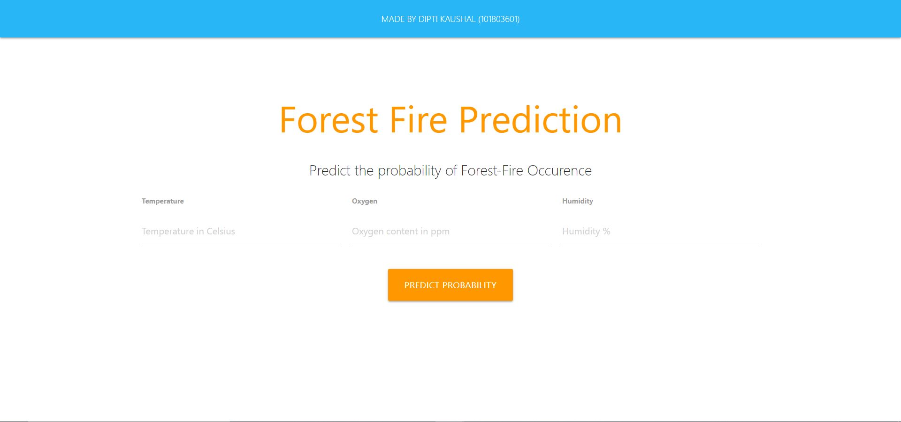
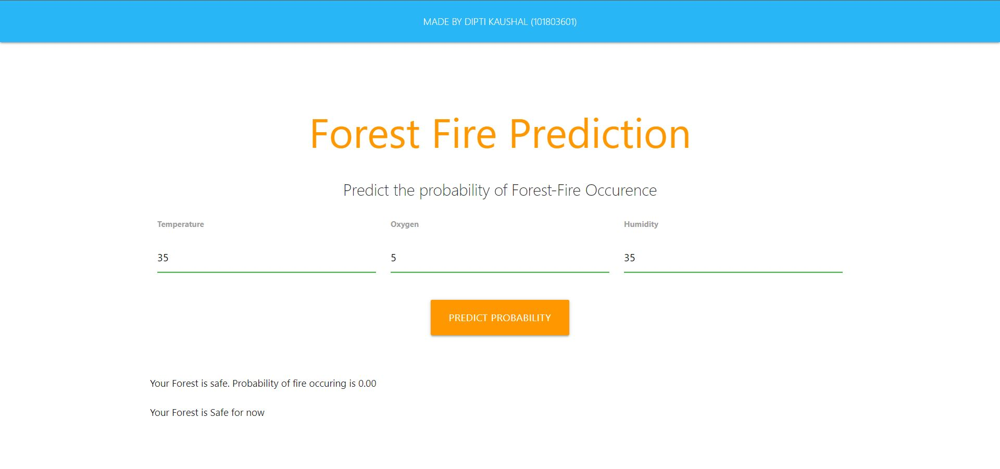
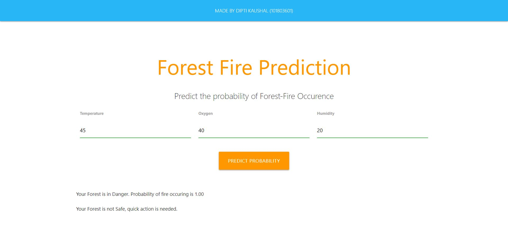
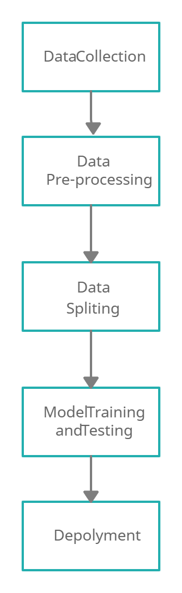

# Forest Fire Predcition

The forest fire is the burning of forest either by natural fire or man-made fire and is related to land clearing and deforestation. Natural forest fire includes an unplanned burning of forest due to lightning, while human-induced forest fire results from the unauthorized burning practice of forests for attaining farmland. 
Forest fires prediction combines weather factors, terrain, dryness of flammable items, types of flammable items, and ignition sources to analyze and predict the combustion risks of flammable items in the forest.
I have implemented supervised learning, a machine learning model for training of the collected data.

In this project the web app predicts the danger of a fire in the forest based on temperature,oxygen and humidity content. 
You can find the deployed app at https://forest-fire-dipti101803601.herokuapp.com/

## Technology Stack used in this project
Python,Logistic Regression ,Flask, HTML, CSS, Heroku

## Methodology

## Novelty
Compared performance of various models and selected Logistic Regression as the best model.
